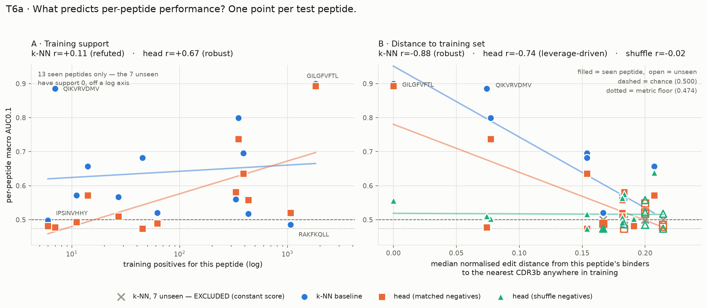

# Findings — TCR–epitope baseline build

Empirical record for the IMMREP23 build. Numbers here were produced by running code in this
repo, not read from a paper. Each claim carries an evidence label:

| Label | Means |
|---|---|
| `observed` | The check ran and the output was seen. A pointer is given. |
| `failure-proven` | The check was also shown able to fail — red first, then green. |
| `claimed` | Read off the code or a README; no run behind it. |

Covers Sessions 1–6 — the complete build, T1 through T6. Last updated 2026-09-06.

**Every headline number below is pinned in `tests/test_findings.py`** and re-derived from the raw
CSVs on each run, so this document fails loudly rather than drifting. That file exists because the
cross-reactive-CDR3b count was first recorded here as 199 — transcribed from a truncated
`value_counts()` display — and the re-derivation caught it at 201.

---

## 1. Environment

| Fact | Value | Evidence |
|---|---|---|
| Python | 3.11.13, arm64 | `observed` |
| torch | 2.14.0 | `observed` |
| `torch.backends.mps.is_available()` | **True**, MPS matmul runs | `observed` — env acceptance criterion |
| transformers | 5.16.1 | `observed` |
| Package manager | `uv`, `pyproject.toml` + `uv.lock`, installs clean on arm64 | `observed` |

### ESM-2 under transformers 5.16.1 — works, no pin-back

`facebook/esm2_t6_8M_UR50D` loads as `EsmModel` and runs a forward pass. `observed`.

- Tokenizer emits `<cls> G I L G F V F T L <eos> <pad>…` — `cls=0`, `eos=2`, `pad=1`.
- `output_hidden_states=True` returns **7 tensors for 6 layers** (embeddings + one per layer).
  T6b's layer sweep is unblocked.
- MPS vs CPU on `last_hidden_state`: **max abs diff 4.8e-06**. MPS is safe for embedding.

**Trap for T5:** the checkpoint contains no pooler, so loading `EsmModel` reports
`pooler.dense.weight` / `pooler.dense.bias` as MISSING and **randomly initialises them**.
`pooler_output` is therefore noise. Mean-pool over `hidden_states` and pass
`add_pooling_layer=False` so this is structural rather than a convention someone can forget.
The `lm_head.*` UNEXPECTED lines in the same report are benign — that is the MLM head being
discarded because we load the base encoder.

---

## 2. Dataset — IMMREP23 (T1)

Source: `github.com/justin-barton/IMMREP23`, MIT. `scripts/fetch_data.sh` re-pulls it.
Full working: `notebooks/01_inventory.ipynb`. All figures below `observed`.

### The seven answers

| # | Question | Answer |
|---|---|---|
| 1 | Row counts | `test.csv` 3,484 · `solutions.csv` 3,484 · `VDJdb_paired_chain.csv` 11,312 |
| 2 | Label balance | 598 pos / 2,886 neg = **17.2% positive** |
| 3 | Unique peptides | **808 train, 20 test**, 13 shared |
| 4 | **Seen / unseen** | **13 of 20 test peptides seen, 7 unseen. 69.4% of test rows seen, 30.6% unseen.** |
| 5 | Lengths | Peptide 8–13 (median 9); CDR3b 5–23 (median 12). No train/test length shift. |
| 6 | Positives-only? | **Yes** — all 11,312 training rows are `Target == 1` |
| 7 | Per-peptide balance | Uneven in volume (`GILGFVFTL` = 15% of test rows, top-5 = 51%); near-uniform in rate (exactly 1/6 for 17 of 20 peptides) |

`test.csv` and `solutions.csv` are the same rows; `solutions.csv` adds `Label` and `Usage`.
Leaderboard split is lopsided — 267 Public / 3,217 Private.

**The work order's surprise condition did not fire.** 7 of 20 unseen is a substantial minority,
not a majority, so the seen/unseen gap should be measurable rather than total. No reframing.

### How the test set was actually built

Per the repo README (`claimed`), confirmed by the row structure (`observed`): negatives were made by
re-pairing each positive TCR with peptides at **Levenshtein distance > 3** from its true partner,
**5 negatives per positive**. Consequences visible in the data:

- Per-peptide neg:pos is exactly 5.0 for **17 of 20** peptides. The three that deviate
  (`GILGFVFTL` 4.11, `RAKFKQLL` 4.84, `VSDGGPNLY` 4.97) are where a generated negative collided
  with a real binder and was relabelled.
- 3,484 test rows contain only **632 unique CDR3b** — each TCR appears ~5.5 times, once as a
  positive and ~5 times as a negative against other peptides.
- **123 of those 632 CDR3b are never a positive anywhere in the test set.**
- Some CDR3b are positive for many peptides — max **13**. Cross-reactivity is real and present.

### Training support is a spectrum, not a flag

The most load-bearing finding in T1. "Seen" hides a 300× range in how much training data backs a
test peptide:

| Peptide | Train positives | | Peptide | Train positives |
|---|---:|---|---|---:|
| `GILGFVFTL` | 1,818 | | `TPRVTGGGAM` | 62 |
| `RAKFKQLL` | 1,066 | | `RPHERNGFTVL` | 27 |
| `YLQPRTFLL` | 434 | | `EPLPQGQLTAY` | 14 |
| `NLVPMVATV` | 390 | | `YVLDHLIVV` | 11 |
| `GLCTLVAML` | 351 | | `QIKVRVDMV` | 7 |
| `IVTDFSVIK` | 332 | | `IPSINVHHY` | **6** |
| `RPPIFIRRL` | 45 | | | |

Macro AUC0.1 weights `IPSINVHHY` (6 training TCRs) exactly as much as `GILGFVFTL` (1,818).
This is why T6a plots score against training support on a log axis.

### Leakage: 17.9% of test positives are verbatim in train

**107 of 598 test positives have their exact `(Peptide, CDR3b)` pair in the training file.**
`observed`.

This is a property of the benchmark — the organisers drew test TCRs from overlapping sources.
It is not a bug in this repo and is not being fixed. What it means:

- A nearest-neighbour baseline scores those 107 rows at similarity 1.0 for free. Part of any
  "strong on seen peptides" result is exact lookup, not generalisation. **T4 must be scored both
  with and without them** — the difference is the size of the lookup component.
- **8 test rows labelled `0` are positives in train.** They are unwinnable by anything that trusts
  the training labels, and they are a hard ceiling on achievable score. Left in place by decision.

### Other data facts worth not rediscovering

- **HLA naming differs between files.** Train uses `HLA-A*01:01`; test uses `A*01:01`. Any join or
  feature on HLA needs normalising first. `observed`.
- Train has **2,007 duplicate `(Peptide, CDR3b)` rows** — distinct TCRs (different alpha chain or
  V/J genes) that collide once you look only at CDR3b. `observed`.
- Train has **8,993 unique CDR3b** across 808 peptides. The full cross product is 7.3M pairs.
- **201 of 8,993 training CDR3b bind more than one peptide** (max 12). This is why cognate
  exclusion in T3 is keyed on the whole table, not the row.
- `CDR3a` has 2 nulls in train; `CDR3b` is complete. Another reason to model beta first.
- Sequence columns are consistent between train and test: `CDR3b` excludes the flanking C and F
  (`ASAPTSAMGEQY`), `CDR3b_extended` includes them (`CASAPTSAMGEQYF`).

---

## 3. Metrics (T2)

`src/cognate/metrics.py`, 15 tests in `tests/test_metrics.py`.

### Spec, confirmed

The IMMREP23 README states the metric explicitly (`claimed`, but unambiguous): per-peptide partial
ROC AUC truncated at FPR ≤ 0.1, **McClish-standardised**, then arithmetic mean over peptides. That
is exactly `sklearn.metrics.roc_auc_score(..., max_fpr=0.1)` applied per peptide group. The
optional lessons-learned PDF is not needed for this.

Peptides with only one class present are skipped and counted. On the full test set **0 peptides are
skipped**; the branch will fire once T6 slices into distance bins.

### Hand-computed acceptance values

10-row toy, derivation in the `tests/test_metrics.py` module docstring:

```
y_true  = [1, 1, 0,  0,  0,  0,  0,  0,  0,  0   ]
y_score = [.9,.5,.8, .7, .6, .4, .3, .2, .1, .05 ]
```

| Metric | Hand value | |
|---|---|---|
| AUROC | 13/16 = 0.8125 | correctly ordered (pos, neg) pairs / 16 |
| AUPRC | 0.7 | 1.00×0.5 + 0.40×0.5 |
| AUC0.1 | 14/19 ≈ 0.7368 | partial area 0.05, McClish over [0.005, 0.1] |

`failure-proven` — perturbing these three constants turns 7 tests red.

### McClish AUC0.1 has a floor of 9/19 ≈ 0.474, not 0

The most misreadable property of the metric. McClish maps a partial area of 0 onto
`0.5 × (1 − 0.005/0.095) = 9/19`. So:

- **random = 0.500**
- **worst possible = 0.474**
- the entire below-random range is 26 thousandths wide

A score of 0.48 is catastrophic, not "slightly below chance". Pinned in
`test_auc01_floor_is_not_zero`.

### Bootstrap CIs — and a spec amendment

The work order asked for resampling *within* peptides. The stated motivation — the average is over
20 peptides, 7 on the unseen slice — is **peptide-selection** noise, which within-peptide
resampling structurally cannot see. Implemented three modes and defaulted to the two-level cluster
bootstrap:

| `mode` | Resamples | Sees |
|---|---|---|
| `"rows"` | TCRs within a fixed peptide set | within-peptide noise only |
| `"groups"` | which peptides enter the average | peptide-selection noise only |
| `"both"` (default) | peptides, then rows within each drawn peptide | both |

`test_group_resampling_widens_the_interval` asserts `both` gives a strictly wider interval than
`rows`. `failure-proven` by construction of the assertion.

### The noise floor you are working against

Random predictor, real test set, `mode="both"`, `n_boot=1000`, `seed=0`. `observed`.

| Slice | Peptides | macro AUC0.1 | AUROC | AUPRC | CI width |
|---|---:|---|---|---|---:|
| all | 20 | 0.509 [0.495, 0.529] | 0.500 [0.468, 0.537] | 0.174 [0.155, 0.202] | 0.034 |
| seen | 13 | 0.511 [0.493, 0.540] | 0.505 [0.465, 0.551] | 0.179 [0.153, 0.215] | 0.047 |
| unseen | 7 | 0.504 [0.484, 0.535] | 0.489 [0.414, 0.543] | 0.169 [0.141, 0.221] | **0.051** |

**On the unseen slice, a gap smaller than ~0.05 is indistinguishable from noise.** AUPRC's baseline
sits at the positive rate (0.174), not 0.5.

### API

```python
evaluate(y_true, y_score, groups, *, subset=None, label="all",
         mode="both", n_boot=1000, confidence=0.95, seed=0) -> ScoreReport
```

`subset` is a boolean mask applied to all inputs first, so seen/unseen and
exact-match-excluded slices reuse the same scorer rather than a variant of it.
`ScoreReport.per_group_auc01` gives the 20 per-peptide values T6a plots.

---

## 4. Negative sampling (T3)

`src/cognate/negatives.py`, 20 tests. **Full rationale lives in
[`negative_sampling.md`](negative_sampling.md)** — only the measurements are repeated here.

**Default for T4–T6: `shuffle`, `ratio=5.0`, `seed=0`.**

| | `shuffle` | `hard` |
|---|---|---|
| Median Levenshtein(true, drawn) | 8 | 5 |
| Draws within distance 3 | **0.13%** | **17.7%** |
| Draws within distance 1 | 0.07% | 10.2% |
| Peptides used (of 808) | 808 | 741 |
| Top-5 peptide share | 0.8% | 17.1% |
| Wall clock, 56,560 negatives | 0.2 s | 0.6 s |
| Seeded | yes | no — deterministic, ties break alphabetically |

All `observed` on the real 11,312-row training set. Both strategies are byte-identical across
repeat calls at a fixed seed (`observed`, and asserted in tests).

The one measurement that decides the default: **`shuffle` lands within distance 3 only 0.13% of the
time**, so it already satisfies the organisers' >3 filter without one being applied. `ratio=5.0`
matches the test set's 1:5 construction so AUPRC stays comparable between train and test.

What each picks for `GILGFVFTL`:

```
shuffle -> TMETIDWKV, LPPSYTNSF, RFPLTFGWCF, WLTYHGAIK, NTNSSPDDQIGYY
hard    -> GILEFVFTL, GILGLVFTL, ILGFVFTLT,  ALLLQLFTL, ALYGFVPVL
```

Two caveats to carry into any `hard` ablation: it is **weaker than its name** (only 10.2% of draws
within distance 1 — with 808 peptides most have no close relative), and it **concentrates** (67
peptides never drawn). Both are confounds layered on top of the distance effect. And `hard` targets
exactly the band the test set excludes, so a regression there is not evidence that hard negatives
are a bad idea.

---

## 5. Nearest-neighbour baseline — T4 v1

`src/cognate/baseline_knn.py`. Score = highest normalised Levenshtein similarity on `CDR3b`
to any training positive **for that peptide**. No learning. Scores 3,484 test rows in <0.1 s.
v2 (BLOSUM62 k-mer kernel) deliberately not built.

### Precondition check

All 115 verbatim `(Peptide, CDR3b)` test rows score **exactly 1.0** under
`Levenshtein.normalized_similarity`. No whitespace, case, or non-standard-residue problems in
`CDR3b` in either file. `observed`.

**0 exact matches fall on unseen peptides** — structurally guaranteed, since a verbatim pair
requires the peptide to be in training. The unseen-with and unseen-without slices are therefore
the same rows.

### The four numbers

`mode="both"`, `n_boot=1000`, `seed=0`. All `observed`.

| Slice | n | peptides | macro AUC0.1 | AUROC | AUPRC |
|---|---:|---:|---|---|---|
| all | 3,484 | 20 | 0.592 [0.540, 0.656] | 0.595 [0.517, 0.692] | 0.408 [0.234, 0.575] |
| **seen** | 2,418 | 13 | **0.641 [0.569, 0.724]** | 0.685 [0.584, 0.783] | 0.508 [0.283, 0.696] |
| **seen, exact excluded** | 2,303 | 13 | **0.591 [0.545, 0.646]** | 0.581 [0.507, 0.650] | 0.261 [0.191, 0.366] |
| **unseen** | 1,066 | 7 | **0.500 [0.500, 0.500]** | 0.500 [0.500, 0.500] | 0.167 [0.145, 0.192] |
| **unseen, exact excluded** | 1,066 | 7 | 0.500 [0.500, 0.500] | 0.500 [0.500, 0.500] | 0.167 [0.145, 0.192] |
| seen, exact held out of db | 2,418 | 13 | 0.632 [0.566, 0.708] | 0.683 [0.584, 0.777] | 0.471 [0.295, 0.636] |

**Acceptance met:** seen macro AUC0.1 = 0.641 with the CI lower bound at 0.569, clear of 0.5.
The T4 surprise condition (near-random on seen) did not fire.

### The unseen 0.500 is arithmetic, not measurement

The baseline's database is keyed by peptide, so an unseen peptide has an **empty database** and
every one of its 1,066 rows takes the default score of 0. A constant score column has AUC0.1
exactly 0.5 and zero bootstrap variance — hence `[0.500, 0.500]`. This is the README-prescribed
fallback for unpredictable peptides.

Read it as *the baseline is structurally incapable of ranking unseen peptides*, not as *the
baseline generalises at chance level*. Those are different claims and only the first is supported.
A peptide-agnostic fallback database would produce a measured number instead; not built, since the
spec defines the database per-peptide.

### Lookup-table decomposition

Marginal CIs on the two seen slices overlap heavily, so the difference cannot be read off the
table above. Both slices come from one test set, so the correct test is a **paired** bootstrap that
draws the same peptides for both arms — `metrics.compare_macro_auc01`. `observed`:

| Comparison | Difference | p |
|---|---|---|
| seen (0.641) − seen minus exact **rows** (0.591) | **+0.051 [0.003, 0.106]** | **0.040** |
| seen (0.641) − exact held out of the **database** (0.632) | +0.009 [−0.026, 0.043] | 0.618 |

These are two different questions and the contrast between them is the actual finding:

- Dropping the 115 leaked rows costs **0.051** — they were **easy rows**, and including them
  inflates the headline by about a twentieth of a point.
- Denying the database the verbatim answer, while keeping the rows, costs **0.009 and is
  indistinguishable from zero** — the second-nearest neighbour ranks those rows nearly as well.

So the leakage inflates the score by making the *evaluation set* easier, **not** by letting the
method do table lookup. The database already contains near-duplicates of the leaked TCRs. Reporting
"17.9% of the score is lookup" would have been wrong.

Seen vs unseen cannot be compared this way — the peptide sets are disjoint, so there is nothing to
pair on. `compare_macro_auc01` raises rather than silently producing an unpaired number.

### Per-peptide results, and database saturation

| Peptide | Train support | AUC0.1 | mean score, pos | mean score, neg | gap |
|---|---:|---:|---:|---:|---:|
| GILGFVFTL | 1,818 | 0.900 | 0.951 | 0.734 | 0.217 |
| RAKFKQLL | 1,066 | **0.485** | 0.760 | 0.739 | 0.021 |
| YLQPRTFLL | 434 | 0.518 | 0.711 | 0.688 | 0.023 |
| NLVPMVATV | 390 | 0.696 | 0.806 | 0.707 | 0.099 |
| GLCTLVAML | 351 | 0.799 | 0.859 | 0.686 | 0.174 |
| IVTDFSVIK | 332 | 0.560 | 0.735 | 0.697 | 0.038 |
| TPRVTGGGAM | 62 | 0.520 | 0.628 | 0.617 | 0.011 |
| RPPIFIRRL | 45 | 0.682 | 0.703 | 0.601 | 0.102 |
| RPHERNGFTVL | 27 | 0.567 | 0.616 | 0.588 | 0.027 |
| EPLPQGQLTAY | 14 | 0.657 | 0.653 | 0.509 | 0.144 |
| YVLDHLIVV | 11 | 0.572 | 0.560 | 0.519 | 0.042 |
| QIKVRVDMV | 7 | **0.885** | 0.822 | 0.476 | 0.346 |
| IPSINVHHY | 6 | 0.498 | 0.451 | 0.507 | −0.056 |

Correlations across the 13 seen peptides (n=13 — treat magnitudes as indicative, but the
+0.983 is not noise):

| | r |
|---|---:|
| log₁₀(training support) vs **AUC0.1** | **+0.109** |
| log₁₀(training support) vs mean score of **negatives** | **+0.983** |
| log₁₀(training support) vs mean score of positives | +0.697 |
| log₁₀(training support) vs **positive−negative gap** | **+0.001** |
| positive−negative gap vs AUC0.1 | **+0.932** |

**Database saturation.** Adding training TCRs raises the score of negatives almost perfectly with
database size (r=+0.983) and the score of positives less (r=+0.697). A max-over-database operator
has no scale correction — with 1,818 candidates almost any query finds a close match.

**Corrected in Session 4 (§6).** The saturation effect is real but it is *invisible to macro
AUC0.1 by construction*, so it was never a candidate explanation for the per-peptide scores. The
metric is computed per peptide and AUC is rank-based, so a per-peptide level shift cannot move it —
verified exactly, not approximately. What the numbers below actually show is that *within-peptide
discrimination* (the positive−negative gap, r=+0.932 with AUC0.1) does not improve with support
(r=+0.001). Saturation distorts **pooled** metrics such as global AUROC, not the headline.

`RAKFKQLL` scores 0.485 on 1,066 training TCRs; `QIKVRVDMV` scores 0.885 on 7. Small databases are
high variance — sharply specific or useless — but not systematically worse.

**This contradicts the T6a hypothesis on record.** Training support explains ~1% of the variance in
per-peptide AUC0.1 for this baseline (r²≈0.012). If distance-to-nearest-training-example tracks the
gap rather than the raw support, the distance panel should be the informative one. The hypothesis is
not yet refuted for the *trained head* — a learned model may use support differently — but for the
k-NN baseline it is.

---

## 6. Score-operator follow-up — is the metric absorbing the inflation?

`observed`, seen slice, `scripts` reproduced inline. The answer is stronger than "barely moves".

### Within-peptide rescaling is *exactly* invariant

| Scoring | macro AUC0.1 | global AUROC |
|---|---|---|
| max (baseline) | **0.641419** | 0.6853 |
| z-scored within peptide | **0.641419** | 0.7202 |
| rank-normalised within peptide | **0.641419** | 0.7129 |

Identical to six decimal places, and provably so rather than coincidentally: macro AUC0.1 is
computed independently per peptide and AUC depends only on ranking, so **any strictly monotonic
within-peptide transform leaves every per-peptide value unchanged**. Asserted to `abs=1e-12` in
`test_macro_auc01_is_invariant_to_within_peptide_rescaling`.

So the metric does not merely absorb the database-saturation inflation — it **cannot see it**.
Global AUROC moves by +0.035 under the same transform, because pooling across peptides is exactly
where the per-peptide scale mismatch bites. Any pooled metric on this data is contaminated by
database size; the macro metric is not.

### Changing the operator does move it, and max wins

Mean-of-top-k is not a monotone transform of the max, so it can and does change the ranking:

| k | 1 | 2 | 3 | 5 | 10 | 25 | 50 | 100 |
|---|---|---|---|---|---|---|---|---|
| macro AUC0.1 | **0.641** | 0.637 | 0.639 | 0.642 | 0.630 | 0.610 | 0.596 | 0.587 |
| AUROC | 0.685 | 0.676 | 0.671 | 0.664 | 0.637 | 0.617 | 0.606 | 0.600 |

Flat within noise for k ≤ 5, then monotonically worse. **The operator choice does not matter in the
regime anyone would use it**, and averaging more neighbours only dilutes the signal. No support for
the idea that the field is leaving something on the table here.

---

## 7. ESM-2 embeddings — T5a

`src/cognate/embed.py`. All layers cached for both models, keyed by sequence string.

### Cost

Deduplication first: **10,369 distinct strings** (815 peptides + 9,554 CDR3b, zero overlap) against
**142,712** if rows were embedded naively — a 13.8× reduction.

| Model | Layers | Hidden | Wall clock | ms/seq | Disk |
|---|---:|---:|---:|---:|---:|
| `esm2_t6_8M_UR50D` | 7 | 320 | **5.7 s** | 0.55 | 93.9 MB |
| `esm2_t12_35M_UR50D` | 13 | 480 | **11.9 s** | 1.15 | 259.8 MB |

MPS, float32, uncompressed `.npz`. Three orders of magnitude under the "if it takes over an hour
something is misconfigured" bar. 650M would be roughly 20× the 35M cost and is still trivial.

`add_pooling_layer=False` confirmed working — the load report no longer lists
`pooler.dense.* MISSING`, so no randomly initialised weights are attached.

### Correctness

Two properties asserted in `tests/test_embed.py`, both `failure-proven` by construction:

- **Padding invariance.** Every sequence embedded alone matches its batched embedding to
  `atol=2e-5` across all layers. Without this, results would silently depend on how sequences
  happened to be grouped into batches.
- **Pooling matches a hand recomputation.** Mean over `hidden_states[-1][0, 1:-1, :]` for
  `GILGFVFTL` equals the cached row. BOS and EOS are excluded; including them would mix a constant
  offset into every embedding and dilute short sequences more than long ones.

Length-sorted batching keeps padding overhead at **6.7%** of real tokens.

### The embeddings are severely anisotropic

Mean pairwise cosine similarity over 1,500 random CDR3b, and effective rank (entropy of the
singular-value spectrum, out of 320 / 480 nominal dimensions):

| 8M layer | 0 | 1 | 2 | 3 | 4 | 5 | 6 |
|---|---|---|---|---|---|---|---|
| mean cos | 0.749 | 0.940 | 0.933 | 0.978 | **0.983** | 0.974 | 0.961 |
| eff. rank | 11.9 | 20.5 | 27.6 | 26.6 | **28.6** | 28.3 | 22.2 |

| 35M layer | 0 | 3 | 5 | **6** | 8 | 10 | 12 |
|---|---|---|---|---|---|---|---|
| mean cos | 0.676 | 0.935 | 0.984 | 0.983 | 0.980 | 0.976 | 0.964 |
| eff. rank | 12.5 | 29.9 | 30.6 | **33.2** | 27.8 | 21.7 | 20.4 |

Every mean-pooled CDR3b points in nearly the same direction — cosine 0.94–0.98 with a standard
deviation as low as 0.007 in the middle layers. The discriminative signal is a small residual on
top of a large shared component, and the usable dimensionality is **20–33, not 320 or 480**.

Three consequences for T5b:

1. **Standardise the features.** An unscaled logistic regression sees a design matrix dominated by
   the shared direction. Centring and scaling is not optional hygiene here, it is the difference
   between fitting signal and fitting the mean.
2. **Keep the head small.** Effective rank ~30 against 640–960 concatenated input dimensions means
   a wide MLP has ample room to fit noise directions.
3. **The layer profile already points where T6b expects.** Effective rank peaks mid-network (8M
   layer 4, 35M layer 6) and the final layer collapses in norm (35M: 118.6 at layer 11 → 7.2 at
   layer 12) because it is shaped for masked-token prediction, not for features.

### The peptide-held-out split will not be TCR-clean by default

The hazard flagged for T5b, quantified on the training set. `observed`.

Building the bipartite peptide↔CDR3b graph gives **684 connected components**, but they are wildly
uneven: the largest holds **64 peptides and 6,026 CDR3b — 67% of all TCRs and 71.8% of all rows**.
663 peptides sit in single-peptide components.

A naive random peptide-held-out split (20% of peptides, 50 trials) leaks:

- shared CDR3b between arms: **mean 80**, range [26, 134]
- validation rows whose CDR3b also appears in training: **mean 10.9%, max 26.8%**

**Splitting on components instead removes it entirely.** Assigning the giant component to training
and sampling whole components into validation until 20% of rows:

```
train 9,048 rows / 275 peptides    val 2,264 rows (20.0%) / 533 peptides
shared peptides: 0    shared CDR3b: 0
```

Note the inversion: validation ends up with *more* peptides than training (533 vs 275) because the
giant component concentrates 71.8% of rows into 64 peptides. A split balanced on rows is not
balanced on peptides, and T5b has to pick which one to balance.

---

## 8. Trained head — T5b, and a bug it exposed in T3

### The T3 bug: `shuffle` leaked peptide identity

Found by asking whether the head could fit its *training* data. It could — global AUROC 0.970 —
against a train macro AUC0.1 of only 0.621. That gap is the signature of a shortcut.

`shuffle` draws the negative peptide **uniformly** over 808 peptides while the positives are
heavily skewed, so the peptide marginal differs enormously between classes:

| Peptide | share of positives | share of `shuffle` negatives | ratio |
|---|---:|---:|---:|
| GILGFVFTL | 16.07% | 0.10% | **159×** |
| RAKFKQLL | 9.42% | 0.10% | 99× |

**Peptide identity alone predicts the label at 0.9396 global AUROC** on a `shuffle` training set —
and at **exactly 0.5000 macro AUC0.1**, because the metric is per-peptide. The headline metric was
immune, which is why this survived two sessions unnoticed. The T3 justification checked the
Levenshtein *distance* profile and never checked *which* peptides were drawn.

New `matched` strategy draws the negative peptide proportional to its positive frequency, which is
what the organisers did (TCRs swapped among the peptides in the set, 5:1 preserved per peptide).
Shortcut falls from **0.9396 to 0.5671**; the residual is structural — a TCR binding `GILGFVFTL`
can never draw `GILGFVFTL` as its own negative. `matched` is the new default. Full correction in
[`negative_sampling.md`](negative_sampling.md).

| negatives | train AUROC | train macro | val macro | test macro | test seen |
|---|---|---|---|---|---|
| `shuffle` | 0.970 | 0.621 | 0.509 | 0.528 | 0.532 |
| `matched` | 0.747 | 0.592 | 0.532 | **0.551** | **0.578** |

### Setup

Component-split positives (train 9,048 / val 2,264, 0 shared peptides, 0 shared CDR3b), `matched`
negatives at 5:1 generated **within each arm separately** so no negative crosses the boundary.
Features are `[p, t, |p−t|, p⊙t]` on standardised embeddings — plain `concat` is structurally
unable to express a peptide-specific TCR ranking, since a linear model on it induces the *same*
TCR ordering for every peptide.

Layer selected on validation, never on test: **35M layer 10**.

### Results

| Slice | n | macro AUC0.1 | AUROC | AUPRC |
|---|---:|---|---|---|
| k-NN / seen | 2,418 | **0.641 [0.569, 0.724]** | 0.685 | 0.508 |
| k-NN / unseen | 1,066 | 0.500 [0.500, 0.500] *(degenerate)* | 0.500 | 0.167 |
| logistic / seen | 2,418 | 0.571 [0.512, 0.647] | 0.670 | 0.447 |
| **logistic / unseen** | 1,066 | **0.502 [0.481, 0.535]** | **0.575 [0.505, 0.629]** | 0.193 |
| MLP / seen | 2,418 | 0.571 [0.518, 0.644] | 0.658 | 0.425 |
| **MLP / unseen** | 1,066 | **0.509 [0.484, 0.547]** | 0.569 [0.475, 0.625] | 0.204 |

Paired bootstrap, same peptides in both arms:

> **SUPERSEDED (Phase A, 2026-09-06).** Every p-value in the table below was produced by a
> `compare_macro_auc01` that drew *independent* row resamples for the two arms even when both arms
> covered identical rows — destroying the pairing it claimed to do — and whose p-value was not
> symmetric under swapping the arms. Fixed in `src/cognate/metrics.py` (shared resample when the
> row sets match; `p = 2·min(tail)`). Corrected values live in `data/headline.json`:
> **logistic seen − k-NN seen p = 0.018 → 0.016**; logistic unseen p = 0.834 → 0.888 (reported
> there as k-NN − head, so the sign of the difference is flipped: −0.0019 [−0.0352, +0.0185]).
> **The two MLP rows were never recomputed** — treat their intervals and p-values as unusable, not
> as merely slightly off. The direction of the headline result is unchanged.

| Comparison | Difference | p | |
|---|---|---|---|
| logistic seen − k-NN seen | **−0.070 [−0.152, −0.011]** | ~~0.018~~ | superseded → **0.016** |
| MLP seen − k-NN seen | −0.071 [−0.155, −0.001] | ~~0.048~~ | superseded, not recomputed |
| logistic unseen − k-NN unseen | +0.002 [−0.018, +0.036] | ~~0.834~~ | superseded → 0.888 |
| MLP unseen − k-NN unseen | +0.009 [−0.015, +0.044] | ~~0.556~~ | superseded, not recomputed |

**The lookup baseline beats the trained head on seen peptides, significantly.** Both are at chance
on unseen.

### Unseen is measurable for the first time — and the answer is split

The degeneracy guard confirms the head is doing real work where the baseline could not:

| | seen | unseen |
|---|---|---|
| k-NN | 75 distinct scores / 2,418 rows | **1 distinct score / 1,066 rows — DEGENERATE** |
| logistic | 2,263 / 2,418 | **1,019 / 1,066 — ok** |
| MLP | 2,235 / 2,418 | 1,008 / 1,066 — ok |

So the unseen number is a measurement, not arithmetic. What it says:

- **macro AUC0.1 on unseen = 0.502 / 0.509.** The random-predictor floor on this exact slice is
  0.504 [0.484, 0.535] (§3). The head is indistinguishable from chance at ranking TCRs *within* an
  unseen peptide.
- **global AUROC on unseen = 0.575 [0.505, 0.629]** for logistic — the CI just clears 0.5.

Those two facts together are the finding: **whatever the head transfers to unseen peptides is
peptide-level, not TCR-specific.** It has learned something about which peptides are generally
bound and nothing about which TCR binds which peptide. Macro AUC0.1 is blind to the former by
construction (§6), which is exactly why the two metrics disagree here.

### The MLP adds nothing

Validation loss is lowest at **epoch 0** and rises monotonically while training loss keeps falling
(0.438 → 0.366 over 9 epochs). The head overfits immediately; early stopping returns essentially a
one-epoch model, and its test scores are identical to logistic regression to three decimals. On
features with effective rank ~30, extra capacity buys nothing.

### T6b (layer sweep) — expectation not supported

20 fits across both models and every layer:

- test macro AUC0.1 spans **0.525 to 0.553 — a spread of 0.028**, smaller than the ~0.05 noise
  floor on this test set.
- validation-to-test Spearman correlation across the 20 fits is **−0.035**. Validation selection
  has no predictive relationship with test performance here.

The nominal "a middle layer beats the last" holds numerically for both models (8M L3 0.541 vs L6
0.539; 35M L9 0.553 vs L12 0.547) but the margins are an order of magnitude below noise. **The
honest reading is that no layer is meaningfully better than any other**, and the anisotropy profile
in §7 predicted a middle-layer advantage that the downstream task does not show.

### Follow-up 2: does the head inflate scores with training support?

Correlation of per-peptide **mean raw score** with log₁₀(training support), 13 seen peptides,
95% CI from 5,000 peptide-level bootstrap resamples:

| Model | r | 95% CI | |
|---|---:|---|---|
| k-NN | **+0.990** | [+0.981, +0.996] | excludes 0 |
| logistic | +0.525 | [−0.123, +0.902] | **includes 0** |
| MLP | +0.511 | [−0.330, +0.843] | **includes 0** |

The prediction was that a fixed-dimension head has no database to saturate, so r should be near
zero. **The point estimates are around +0.51, but at n=13 peptides the intervals include zero.**
The honest statement is that the k-NN effect is real and enormous while the head's is *not
established either way* — 13 peptides cannot separate +0.5 from 0. If it is real, the likely
mechanism is the residual peptide-marginal mismatch that survives `matched` (peptide identity still
gives 0.567 AUROC), which would indeed be training-distribution inflation rather than an operator
artefact. Resolving it needs more peptides, not more modelling.

---

## 9. T6a — what actually predicts per-peptide performance



One point per test peptide. The baseline contributes 13 of the 20: its 7 unseen peptides have an
empty database, so their 0.5 is arithmetic. They are drawn as grey × markers labelled EXCLUDED and
omitted from the baseline's fit — not silently dropped.

**Sampler independence, confirmed rather than assumed.** k-NN scores are **bit-identical** whether
the training frame is positives-only, positives+`shuffle`, or positives+`matched`
(`np.array_equal` → True, max abs diff 0.00e+00). `build_database` filters to `Target == 1`, so
generated negatives never enter. Both panels are on the same footing.

### The result: the two models are limited by different things

| Predictor | k-NN baseline (n=13) | head / matched (n=20) |
|---|---|---|
| **distance to nearest training example** | **r = −0.878, r² = 0.770**, CI [−0.965, −0.494] — excludes 0 | r = −0.735, CI [−0.952, +0.328] — includes 0 |
| **log₁₀ training support** | r = +0.109, r² = 0.012, CI [−0.598, +0.735] — includes 0 | **r = +0.674, r² = 0.455**, CI [+0.355, +0.887] — excludes 0 |

Leave-one-out robustness, which is what separates a finding from a leverage artefact:

| | all 13 seen | drop `GILGFVFTL` | drop top-2 support |
|---|---|---|---|
| k-NN vs distance | −0.878 | **−0.844** | **−0.851** |
| head vs distance | −0.724 | −0.341 | −0.331 |
| k-NN vs support | +0.109 | −0.186 | −0.034 |
| head vs support | +0.674 | **+0.571** | **+0.701** |

**The baseline's distance relationship is the strongest and most robust result in the build**:
distance explains 77% of the variance in its per-peptide score and survives dropping the extreme
point. This is the hypothesis that had never been plotted, and it holds.

**The head's distance relationship does not survive** — r collapses from −0.72 to −0.34 when
`GILGFVFTL` is removed. Reported as leverage-driven, not as a finding.

**The head's support relationship is robust** (+0.57 to +0.70 across subsets), and it is the
predictor that was *refuted* for the baseline. The two models fail for different reasons: the
lookup is limited by how far the query is from anything it has seen; the learned head is limited
by how much data each peptide had.

The two predictors are largely independent — corr(log support, distance) = −0.354, CI
[−0.797, +0.409], includes 0 — so the panels are not restating each other.

### The 7 unseen peptides show no decay, because there is nothing to decay from

Restricted to the 7 unseen peptides, head-vs-distance gives r = +0.128, CI [−0.957, +0.845]. Their
AUC0.1 spans 0.474–0.548 (all at chance) over a distance range of 0.167–0.214. The seen peptides
span 0.474–0.893 over 0.000–0.207. **The decay in panel B happens entirely within the seen
peptides**; by the time a peptide is unseen, performance has already bottomed out.

### The sampler experiment, made deliberate

Head under both samplers on the same points. Mean improvement from `matched`: **+0.047 on seen,
−0.000 on unseen.** It is not a uniform gain — it is concentrated entirely in the three peptides
closest to the training set:

| Peptide | distance | shuffle | matched | Δ |
|---|---:|---:|---:|---:|
| `GILGFVFTL` | 0.000 | 0.556 | 0.893 | **+0.337** |
| `GLCTLVAML` | 0.077 | 0.503 | 0.737 | **+0.234** |
| `NLVPMVATV` | 0.154 | 0.516 | 0.635 | **+0.119** |
| *(all 17 others)* | — | — | — | between −0.067 and +0.037 |

Removing the peptide-frequency shortcut did not make the head broadly better. It let the head use
near-neighbour structure it was previously ignoring in favour of the shortcut — and only where that
structure exists. Under `shuffle` the head's distance correlation is **r = −0.019**: flat. Under
`matched` it at least points the right way.

### The data behind the figure

| Peptide | | support | distance | k-NN | head/matched | head/shuffle |
|---|---|---:|---:|---:|---:|---:|
| `GILGFVFTL` | seen | 1818 | 0.000 | 0.900 | 0.893 | 0.556 |
| `QIKVRVDMV` | seen | 7 | 0.074 | 0.885 | 0.478 | 0.511 |
| `GLCTLVAML` | seen | 351 | 0.077 | 0.799 | 0.737 | 0.503 |
| `NLVPMVATV` | seen | 390 | 0.154 | 0.696 | 0.635 | 0.516 |
| `RPPIFIRRL` | seen | 45 | 0.154 | 0.682 | 0.474 | 0.474 |
| `TPRVTGGGAM` | seen | 62 | 0.167 | 0.520 | 0.489 | 0.474 |
| `RAKFKQLL` | seen | 1066 | 0.182 | 0.485 | 0.520 | 0.498 |
| `RPHERNGFTVL` | seen | 27 | 0.182 | 0.567 | 0.510 | 0.507 |
| `YLQPRTFLL` | seen | 434 | 0.182 | 0.518 | 0.558 | 0.564 |
| `YVLDHLIVV` | seen | 11 | 0.182 | 0.572 | 0.494 | 0.492 |
| `IVTDFSVIK` | seen | 332 | 0.183 | 0.560 | 0.581 | 0.576 |
| `IPSINVHHY` | seen | 6 | 0.191 | 0.498 | 0.482 | 0.502 |
| `EPLPQGQLTAY` | seen | 14 | 0.207 | 0.657 | 0.571 | 0.639 |
| `FTDALGIDEY` | **unseen** | 0 | 0.167 | 0.500 *(excluded)* | 0.488 | 0.474 |
| `SALPTNADLY` | **unseen** | 0 | 0.183 | 0.500 *(excluded)* | 0.474 | 0.487 |
| `TDLGQNLLY` | **unseen** | 0 | 0.200 | 0.500 *(excluded)* | 0.548 | 0.558 |
| `TSDACMMTMY` | **unseen** | 0 | 0.200 | 0.500 *(excluded)* | 0.517 | 0.522 |
| `VSDGGPNLY` | **unseen** | 0 | 0.200 | 0.500 *(excluded)* | 0.522 | 0.485 |
| `VLEETSVML` | **unseen** | 0 | 0.214 | 0.500 *(excluded)* | 0.480 | 0.474 |
| `VTEHDTLLY` | **unseen** | 0 | 0.214 | 0.500 *(excluded)* | 0.485 | 0.517 |

Distance is the median normalised edit distance from that peptide's **positive** test rows to the
nearest CDR3b anywhere in training. Peptide-agnostic on purpose: a peptide-specific distance is
undefined for the 7 unseen peptides, which are the points the figure exists to show. The all-rows
variant was computed and discarded — it spans only 0.154–0.182, because test TCRs are reused across
peptides, and correlates with nothing (k-NN r=+0.13, head r=−0.00).

### Honest limits

Every correlation here rests on 13 or 20 points. Only three clear their bootstrap CI: k-NN vs
distance, head vs support, and the k-NN saturation effect from §5. Everything else is a point
estimate with an interval spanning zero, and is labelled as such.

---

## 10. Decisions on record

| Decision | Rationale | Where |
|---|---|---|
| Default negatives = `shuffle` @ ratio 5.0 | Matches test construction; keeps AUPRC comparable | [`negative_sampling.md`](negative_sampling.md) |
| Bootstrap default = two-level (`both`) | The stated motivation is peptide-selection noise | §3 above |
| Cognate exclusion keyed on `CDR3b` across the whole table | 201 CDR3b bind >1 peptide; models see only CDR3b | `negatives.py` docstring |
| Swapped peptide carries its HLA | HLA is a property of presentation, not of the TCR | `negatives.py` |
| Negatives keep the source positive's **index** | Traceable with no provenance column that could leak into features | `negatives.py` |
| The 8 contradictory rows stay | They are a ceiling on achievable score, not a bug | user decision, Session 2 |
| Skip T4 v2 (BLOSUM62 k-mer kernel) | v1 + the exact-match ablation answers the real question | user decision, Session 3 |
| Default negatives = `matched`, not `shuffle` | `shuffle` let peptide identity alone score 0.94 AUROC | §8, Session 5 |
| Features include `\|p−t\|` and `p⊙t` | Plain concat cannot express a peptide-specific TCR ranking | §8 |
| Generate negatives per split arm | Otherwise a negative pairs a train TCR with a val peptide | `run_layer_sweep.py` |
| Early stopping on val loss, not val macro AUC0.1 | 533 val peptides at ~25 rows each is too coarse to select on | `train_head.py` |
| Compare overlapping slices with a paired bootstrap | Marginal CIs on shared data understate significance | §5, `compare_macro_auc01` |
| Every `evaluate` call carries a degeneracy check | A constant column scores exactly 0.5, identical to random | §9, `diagnose_scores` |
| Embed unique strings, join by string key | 10,369 forward passes instead of 142,712 | §7 |
| Split on bipartite components, not peptides | A peptide-clean split still leaks ~11% of val TCRs | §7 |
| No `orchestrate`, direct edits | Build is interactive and explanation-carrying | user decision, Session 2 |

---

## 11. Open items

- **T4 is done.** v2 (BLOSUM62 k-mer kernel) skipped by decision — v1 plus the exact-match
  ablation answers the question v2 was there to answer.
- **T5 is done.** Heads trained, seen/unseen reported separately with paired bootstrap (§8).
- **T5 surprise condition:** if the trained head massively beats k-NN on *unseen* peptides, suspect
  leakage before celebrating.
- **T6a** is a 20-point scatter, two panels: score vs. training support (log x) and score vs.
  distance-to-nearest-training-example. Hypothesis on record was **training support explains more
  variance than distance**. For the k-NN baseline this is now **contradicted** (r=+0.109, r²≈0.012,
  §5). Still open for the trained head. The 7 unseen peptides sit at exactly 0.5 for the baseline,
  so its distance panel will show a cliff rather than a decay.
- **Follow-up 2 is unresolved, not answered.** Head r=+0.51 with a CI spanning zero (§8). 13
  peptides is too few. More peptides would settle it; more modelling would not.
- **The residual peptide-marginal mismatch in `matched`** (0.567 AUROC from peptide identity alone)
  is the most likely remaining shortcut. Removing it fully would need deterministic per-peptide
  negative allocation rather than weighted sampling.
- **T6a is done (§9).** The build is complete: T1–T6 delivered.
- **The head's distance relationship is unresolved** — leverage-driven at n=20. More test peptides
  would settle it; this benchmark has 20.
- HLA is currently unused. If it ever becomes a feature, normalise the `HLA-` prefix first.
